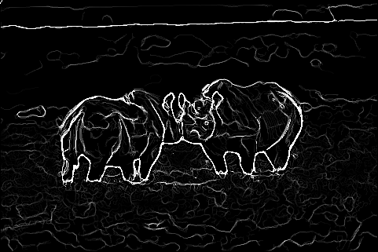
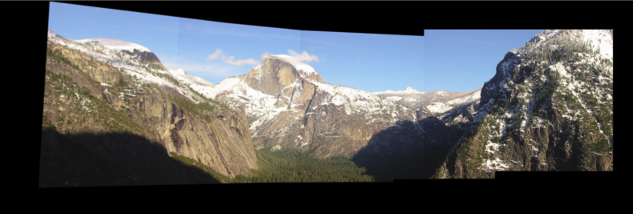
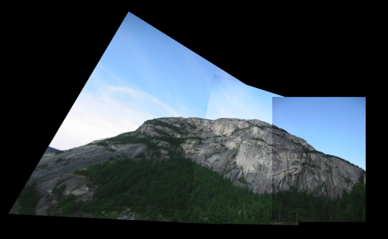
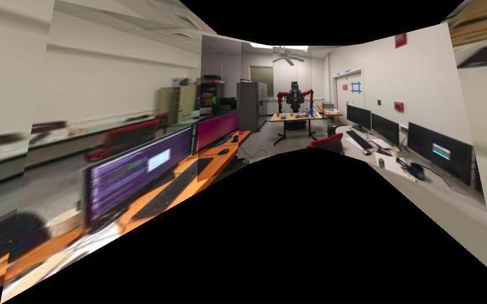
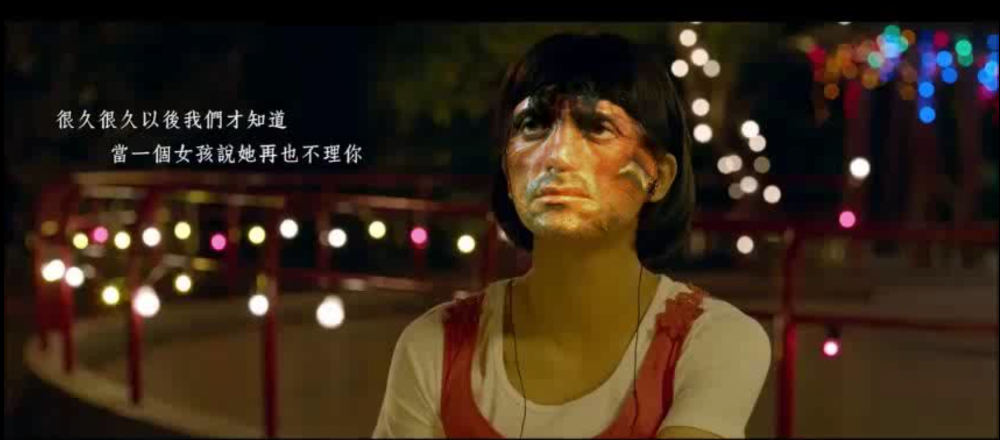

# CMSC-733
Projects for the course CMSC733 - Classical and Deep Learning Approaches for
Geometric Computer Vision

## [HW0: Alohamora!](https://github.com/abhi1625/CMSC-733/tree/master/Abhi1625_hw0)
This was an introductory project for the course and was divided into two phases:

#### Phase 1: Shake My Boundary
Boundary detection is an important, well-studied computer vision problem. Clearly it would be nice to have algorithms which know where one object transitions to another. But boundary detection from a single image is fundamentally diffcult. Determining boundaries could require object-specific reasoning, arguably making the task hard. A simple method to find boundaries is to look for intensity discontinuities in the image, also known of edges.

In this homework, a simplified version of [probability of boundary detection algorithm](https://www2.eecs.berkeley.edu/Research/Projects/CS/vision/grouping/papers/amfm_pami2010.pdf) was developed, which finds boundaries by examining brightness, color, and texture information across multiple scales (different sizes of objects/image). The output of the algorithm is a per-pixel probability of the boundary detected. The simplified algorithm performs much better when compared to classical edge detection algorithms like [Canny](https://ieeexplore.ieee.org/document/4767851) and [Sobel](https://en.wikipedia.org/wiki/Sobel_operator). The original image and the output of the implemented pipeline is shown below:
<!-- -->

 

The implementation detials and results of the homework can be found [here](https://github.com/abhi1625/CMSC-733/blob/master/Abhi1625_hw0/Abhinav_Modi_Hw0.pdf) and instructions on how to run the code are given [here](https://github.com/abhi1625/CMSC-733/tree/master/Abhi1625_hw0).

#### Phase 2: Deep Dive into Deep Learning
For phase 2 of this homework, multiple neural network architectures were implemented. Various criterion like number of parameters, train and test set accuracies were compared for each network architecture and detailed analysis of why one architecture works better than another one was provided. The details about implementation and the results are provided in the submitted [report](https://github.com/abhi1625/CMSC-733/blob/master/Abhi1625_hw0/Abhinav_Modi_Hw0.pdf).

## [HW1: AutoCalib](https://github.com/abhi1625/CMSC-733/tree/master/Abhi1625_hw1)
Estimating parameters of the camera like the focal length, distortion coefficients and principle point is called **Camera Calibration**. It is one of the most time consuming and important part of any computer vision research involving 3D geometry. An automatic way to perform efficient and robust camera calibration was presented by Zhengyou Zhang of Microsoft in this [paper](https://www.microsoft.com/en-us/research/wp-content/uploads/2016/02/tr98-71.pdf) and is regarded as one of the hallmark papers in camera calibration. A pipeline based on Zhang's algorithm, which minimizes reprojection error to estimate the intrinsic camera matrix and the distortion coefficients, was implemented as a part of the project. The implementation details and results can be found [here](https://github.com/abhi1625/CMSC-733/blob/master/Abhi1625_hw1/CMSC733_project2_Faceswap.pdf) and the code is available [here](https://github.com/abhi1625/CMSC-733/tree/master/Abhi1625_hw1).

## [P1 : My AutoPano](https://github.com/abhi1625/CMSC-733/tree/master/Abhi1625_p1)
Homography between 2 image frames is defined as the projective transformation between these frames and is one of the very key concepts in Computer Vision. In this project we used Homography to warp multiple images and stitch a panorama using three different techniques - Traditional approach using feature matching and RANSAC, Supervised approach to predict a 4 point parametrization of Homography between two images and an Unsupervised approach to predict Homography without the presence of a ground truth. Some of the output panoramas generated with the traditional approach are shown below:

 
<!-- img src="Abhi1625_p1/Draft/mypano5.png" align="right" alt="Pano4" height="300" width="900"/ -->

The implementation details and results can be found [here](https://cmsc733.github.io/assets/2019/p1/results/pdf/kmadhira_p1-compressed.pdf) and the code is available [here](https://github.com/abhi1625/CMSC-733/tree/master/Abhi1625_p1)

## [P2 : FaceSwap](https://github.com/abhi1625/CMSC-733/tree/master/Abhi1625_p2)
The aim of this project was to implement an end-to-end pipeline to swap faces in a video just like [Snapchat’s face swap filter](https://www.snapchat.com/) or this [face swap website](http://faceswaplive.com/). It’s a fairly complicated procedure and variants of the approach we've implement have been used in many movies. 

Note that, you need to be aware of ethical issues while replacing faces. Similar methods have been used by people for the creation of fake videos of celibrities called Deep Fakes. Three pipelines were implemented:
- Using [Delaunay Triangulation](http://mathworld.wolfram.com/DelaunayTriangulation.html#:~:text=The%20Delaunay%20triangulation%20is%20a,1992%2C%20p.%2094)
- Using [Thin Plate Splines](https://en.wikipedia.org/wiki/Thin_plate_spline)
- Using a deep learning approach: Joint 3D face reconstruction and dense alignment with position map regression network ([link](https://arxiv.org/abs/1803.07835))

The details of the implementation and results are available [here](https://github.com/abhi1625/CMSC-733/blob/master/Abhi1625_p2/CMSC733_project2_Faceswap.pdf) and the code is available [here](https://github.com/abhi1625/CMSC-733/tree/master/Abhi1625_p2).

The comparison videos for the three pipelines on one of the data sets can be seen here:
 - 
 - 
 - 
 
